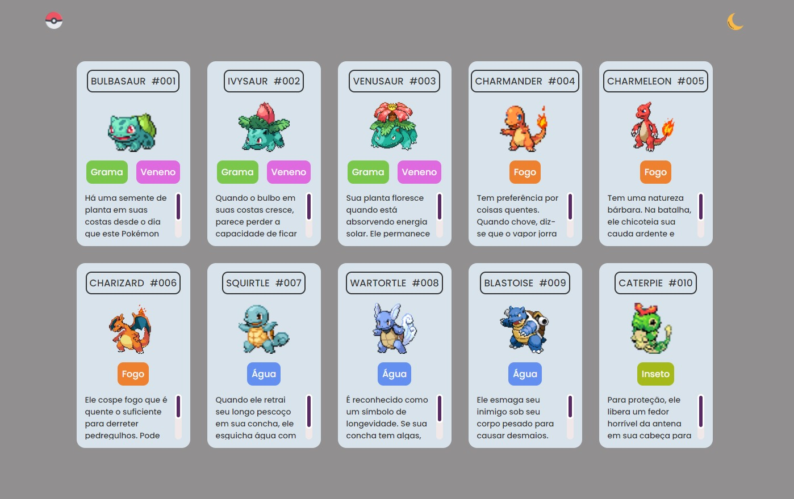

<h1 align="center"> Listagem de Pokémons </h1>

  <a href="#-tecnologias">Tecnologias</a>&nbsp;&nbsp;&nbsp;|&nbsp;&nbsp;&nbsp;
  <a href="#-projeto">Projeto</a>&nbsp;&nbsp;&nbsp;|&nbsp;&nbsp;&nbsp;
  <a href="#memo-licença">Licença</a>

  

 

  

## 🚀 Tecnologias

Esse projeto foi desenvolvido com as seguintes tecnologias:

- HTML e CSS
- JavaScript
- Git e Github

## 💻 Projeto

O projeto "Listagem de Pokémons" foi um evento de oficina realizado com o canal DevemDobro e é uma página que apresenta alguns pokémons, seus detalhes e características e a página também conta com um modo escuro!

 - [Visite o projeto online](https://luishdev.github.io/Projeto-Listagem-Pokémons/)

## :memo: Licença

Esse projeto está sob a licença MIT.

---

Feito com ♥ by LuisHdev :wave: [Acesse meu linkedin!](linkedin.com/in/luis-henrique-a5a086250/)
